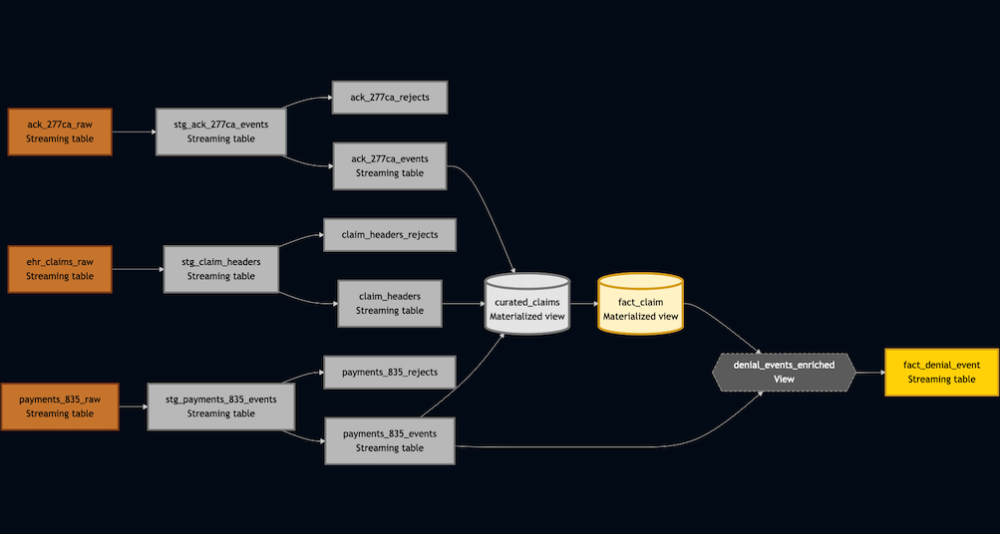

# Claims360: Healthcare Reimbursement Analytics on the Lakehouse 

## Overview  
Hospitals face major financial risk from claim denials and delayed reimbursements.  
Core claim lifecycle data is spread across siloed systems, each providing only part of the story:

- **277CA acknowledgments (clearinghouse → hospital)**: confirms whether a claim was received or rejected at the gateway.  
- **835 remittance advices (payer → hospital)**: shows adjudication results, payments, and denial codes.  
- **Batch EHR exports (hospital internal)**: captures the provider’s internal claim lifecycle, expected amounts, and workqueue status.  

**Why all three matter**:  
- Clearinghouse/payer files give the *external reality* of how payers respond.  
- EHR exports capture the *internal truth* of what the provider submitted and how staff worked the claim.  
- Only by reconciling both perspectives can you uncover mismatches, measure lag, and predict preventable denials.  

The Claims360 Lakehouse unifies these feeds into an end-to-end analytics and ML pipeline.  
This enables **denial prevention, payer benchmarking, and cash flow forecasting**, improving hospitals’ net reimbursement.

---

## Architecture (Medallion)  
- **Bronze** → Raw ingestion with schema enforcement + checkpoints.  
- **Silver** → Standardized, deduplicated, reconciled across sources (expectations applied).  
- **Gold** → De-identified KPIs, payer benchmarks, cashflow forecasts, and ML scores.  
- **ML** → Denial-risk model scored back into Gold.  
- **Governance** → Unity Catalog RBAC, PHI masking, lineage.  

---

## Repo Structure

| Folder / File           | Description                                                                                 |
|--------------------------|---------------------------------------------------------------------------------------------|
| `data/`                 | Synthetic datasets (277CA, 835, EHR batch exports, staffing)                                |
| `notebooks/`            | PySpark notebooks: Bronze ingestion, Silver transforms, Gold aggregates, ML training        |
| `pipelines/`            | Delta Live Tables / Lakeflow SQL pipeline definitions                                       |
| `ml/`                   | Feature engineering queries, training scripts, batch scoring UDF, and model card            |
| `dashboards/`           | DBSQL dashboard queries and alert logic                                                     |
| `setup/`                | Unity Catalog setup scripts, governance grants, sample data seeding, and cluster configs    |
| `schemas/`              | Schema contracts (e.g., 277CA.json, 835.json, ehr.json)                                     |
| `tests/`                | Unit tests (pytest) and fixtures for validating transforms and expectations                 |
| `configs/`              | Environment-specific configs (dev, qa, prod) for pipelines and jobs                         |
| `docs/`                 | Documentation (data dictionary, expectations, lineage, diagrams, architecture)              |
| `.github/workflows/`    | CI/CD workflows (Python linting, SQL validation, unit tests)                                |

---

## Project Phases (MVP)  
1. **Foundations** – Unity Catalog, env setup, PHI policy.  
2. **Synthetic Data** – Generate EHR, 277CA & 835 JSON/CSV with realistic noise.  
3. **Bronze** – Auto Loader ingestion, schema enforcement, rescue rows.  
4. **Silver** – Deduplication, normalization, reconciliation, expectations + quarantine.  
5. **Gold** – Incremental KPIs (denial rates, time-to-payment).  
6. **ML** – One denial-risk classification model, batch scored into Gold.  
7. **Dashboards** – DBSQL dashboard + basic alerts.  

---

## Tech Stack
- Databricks Lakehouse (Lakeflow, Unity Catalog, DBSQL)  
- Delta Lake (Auto Loader, CDF, OPTIMIZE, liquid clustering)  
- MLflow (model registry, batch scoring)  
- GitHub Actions (CI: linting, tests, SQL checks)  

---

## Business Impact  

By unifying **clearinghouse acknowledgments (277CA), payer remittances (835), and provider EHR exports**, hospitals can:  
1. Detect claim rejections earlier  
2. Monitor payer denial patterns  
3. Forecast reimbursement risk  
4. Benchmark operational performance  
5. Reconcile internal expectations with external adjudication for true financial visibility  

---

## Data Flow

The diagram below shows how EHR batch exports, 277CA acknowledgments, and 835 remittances flow through the Lakehouse (Bronze → Silver → Gold).  

  
Diagram source: [claims360_data_flow.mmd](./claims360_data_flow.mmd)
